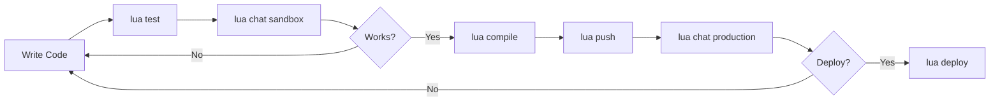

# 🤖  AI Agent 

Welcome to our AI Agent! This is a fully-featured  AI agents with custom tools, webhooks, scheduled jobs, and message processors. It's designed to handle various tasks efficiently.

### Directory Structure

```
src/
├── index.ts                    # 🎯 LuaAgent - Your agent's configuration
├── skills/                     # Tools grouped by functionality
│   ├── tools/                 # Individual tool implementations
│   │   ├── GetWeatherTool.ts  # Example: External API integration
│   │   ├── ProductsTool.ts    # Example: CRUD operations
│   │   ├── BasketTool.ts      # Example: Shopping cart
│   │   └── SmartBasketTool.ts # Example: Complex tool with state
│   ├── product.skill.ts       # Skill that groups product tools
│   └── basket.skill.ts        # Skill that groups basket tools
├── webhooks/                   # HTTP endpoints
│   ├── PaymentWebhook.ts      # Example: Payment notifications
│   └── UserEventWebhook.ts    # Example: External events
├── jobs/                       # Scheduled tasks
│   ├── DailyCleanupJob.ts     # Example: Recurring cleanup
│   └── HealthCheckJob.ts      # Example: Monitoring job
├── preprocessors/              # Before-message processing
│   └── messageMatching.ts     # Example: Route messages
└── postprocessors/             # After-response processing
    └── modifyResponse.ts      # Example: Format responses
```

---

## 🤖 Your Agent at a Glance

Your agent is configured in `src/index.ts`:

## Staff Management Events (staff-management-events.ts)
Purpose: Optimizes workforce operations and task distribution
Events Handled:

clock_in/out - Roster management
break_start/end - Availability tracking
table_assigned/transferred - Workload distribution
section_assigned - Zone management
task_assigned/completed - Task tracking
alert_triggered - Staff communications
performance_logged - Metrics tracking
tip_reported - Financial tracking
incident_reported - Manager escalation

## Key Features:

Real-time workload scoring (0-100)
Automatic workload balancing
Performance metrics tracking
Manager attention flags


## Forecasting Events (forecasting-events.ts)
Purpose: Predictive analytics for demand, inventory, and staffing
Events Handled:

forecast_generated - Covers, revenue, peak hours predictions
trend_detected - Identify up/down trends with drivers
anomaly_detected - Flag unusual patterns
reorder_alert - Inventory replenishment warnings
capacity_warning - High demand alerts
demand_spike - Surge preparation
inventory_optimization - Cost reduction recommendations
staffing_recommendation - Optimal scheduling
seasonal_pattern - Long-term planning insights
forecast_accuracy_check - Model validation

## Key Features:

Confidence scoring (0-100%)
Action prioritization (low/medium/high/critical)
Actionable recommendations
Cost savings calculations
External factor integration (weather, events, holidays)
  

  skills: [
    staffManagementSkill,
    forecastingSkill,
    // ... other skills
  ],
  webhooks: [
    // paymentWebhook,  // Uncomment to enable
  ],
  
  jobs: [
    // dailyCleanupJob,  // Uncomment to enable
  ],
  
  preProcessors: [
    // messageMatchingProcessor,  // Uncomment to enable
  ],
  
  postProcessors: [
    // responseModifierProcessor,  // Uncomment to enable
  ]
;


## 🎓 Learning Path

### Beginner
1. ✅ Read [QUICKSTART.md](QUICKSTART.md)
2. ✅ Run `lua test` to try existing tools
3. ✅ Run `lua chat` to interact with your agent
4. ✅ Modify the agent persona in `src/index.ts`

### Intermediate
1. ✅ Create your first custom tool
2. ✅ Group tools into a skill
3. ✅ Add the skill to your LuaAgent
4. ✅ Test and deploy with `lua push`

### Advanced
1. ✅ Create webhooks for external integrations
2. ✅ Schedule jobs for automated tasks
3. ✅ Add preprocessors to route/filter messages
4. ✅ Use postprocessors to format responses
5. ✅ Implement complex tools with external APIs

---

## 🔑 Key Features

### Intelligent Tools
Your agent can use tools to accomplish tasks:
```typescript
// User: "What's the weather in Tokyo?"
// Agent uses: get_weather tool
// Response: "It's 72°F and sunny in Tokyo"
```

### External Integrations
Connect to any API:
```typescript
// Stripe, OpenAI, Pinecone, custom APIs
const result = await axios.post(API_URL, data);
```

### User Context
Access user data in every tool:
```typescript
const user = await User.get();
const preferences = user.preferences;
```

### Persistent Storage
Store data across conversations:
```typescript
await Data.create('notes', { 
  title: "Meeting Notes",
  content: "..." 
});
```

### Scheduled Automation
Run tasks on a schedule:
```typescript
// Every day at 9 AM
schedule: {
  type: "cron",
  pattern: "0 9 * * *"
}
```

### Real-time Events
Receive HTTP webhooks:
```typescript
// POST /webhook/{webhookId}
// Process payment confirmations, order updates, etc.
```

---

## 📊 Development Workflow



### Commands Reference

| Command | Purpose | When to Use |
|---------|---------|-------------|
| `lua test` | Test individual tools | During development |
| `lua chat` | Interactive testing | Validate tool interactions |
| `lua compile` | Bundle your code | Before pushing |
| `lua push` | Upload to server | Ready to deploy |
| `lua deploy` | Publish to production | Make live for users |
| `lua push all --force` | Batch push all | CI/CD pipelines |

---

## 🔒 Environment Variables

Store sensitive data in `.env`:

```bash
# Copy from example
cp env.example .env

# Add your API keys
OPENAI_API_KEY=sk-...
STRIPE_SECRET_KEY=sk_live_...
PINECONE_API_KEY=...

# Optional: For CI/CD
LUA_API_KEY=your-lua-api-key
```

**Priority:**
1. System keychain (most secure)
2. `LUA_API_KEY` environment variable
3. `.env` file

---

## 🎨 Customization Guide

### 1. Update Agent Identity

Edit `src/index.ts`:

```typescript
export const agent = new LuaAgent({
  name: 'my-customer-support-bot',  // ✏️ Change this
  
  persona: `You are Sarah, a friendly customer support agent...`,  // ✏️ Customize
  
  welcomeMessage: 'Hi! I\'m Sarah. How can I help you today?',  // ✏️ Personalize
  
  // ...
});
```

### 2. Add Your Own Tool

Create `src/skills/tools/MyTool.ts`:

```typescript
import { LuaTool } from "lua-cli/skill";
import { z } from "zod";

export default class MyTool implements LuaTool {
  name = "my_tool";
  description = "What this tool does";
  
  inputSchema = z.object({
    param: z.string()
  });

  async execute(input: z.infer<typeof this.inputSchema>) {
    // Your logic here
    return { result: "success" };
  }
}
```

Add to a skill in `src/index.ts`:

```typescript
import MyTool from './skills/tools/MyTool';

const mySkill = new LuaSkill({
  name: 'my-skill',
  description: 'My custom skill',
  context: 'Use these tools for...',
  tools: [new MyTool()]
});

export const agent = new LuaAgent({
  // ...
  skills: [...existingSkills, mySkill],
});
```

### 3. Configure Webhooks

Uncomment in `src/index.ts`:

```typescript
import paymentWebhook from './webhooks/PaymentWebhook';

export const agent = new LuaAgent({
  // ...
  webhooks: [paymentWebhook],  // ✅ Enabled
});
```

Get your webhook URL after deployment:
```
https://webhook.heylua.ai/{agentId}/{webhookId}
```

### 4. Schedule Jobs

Uncomment in `src/index.ts`:

```typescript
import dailyCleanupJob from './jobs/DailyCleanupJob';

export const agent = new LuaAgent({
  // ...
  jobs: [dailyCleanupJob],  // ✅ Enabled
});
```

---

## 📚 Documentation

### Comprehensive Guides
- **[Quick Start Guide](QUICKSTART.md)** - Step-by-step tutorial
- **[Example Skills](src/skills/)** - Browse working examples
- **[Example Webhooks](src/webhooks/)** - Webhook patterns
- **[Example Jobs](src/jobs/)** - Job scheduling examples

### Official Documentation
- **Lua Docs:** https://docs.heylua.ai
- **CLI Reference:** https://github.com/heylua/lua-cli
- **Community:** https://community.heylua.ai

---

## 🧪 Testing Strategy

### Local Testing (Recommended)

```bash
# Test individual tools
lua test

# Interactive chat testing
lua chat
# Select: Sandbox
```

**Why sandbox?**
- ✅ Uses your local code (not deployed)
- ✅ Safe for experimentation
- ✅ Instant feedback
- ✅ No production impact

### Production Testing

```bash
lua chat
# Select: Production
```

**When to use:**
- ✅ After deploying
- ✅ Validate production behavior
- ✅ Test with real data

---

## 🚀 Deployment Options

### Option 1: Interactive (Recommended for First Time)

```bash
lua push
# Select component type
# Confirm version
# Choose whether to deploy
```

**Best for:**
- Learning the deployment process
- Reviewing changes before deploying
- Fine-grained control

### Option 2: Batch Deployment (CI/CD)

```bash
lua push all --force --auto-deploy
```

**What happens:**
1. Compiles all code
2. Auto-bumps patch versions
3. Pushes all skills, webhooks, jobs, processors
4. Deploys everything to production

**Best for:**
- CI/CD pipelines
- Batch updates
- Production deployments

---

## 💡 Pro Tips

### Development
- ✅ Use `lua test` frequently during development
- ✅ Test in sandbox before deploying
- ✅ Keep tools small and focused (single responsibility)
- ✅ Use TypeScript for better error catching

### Tools
- ✅ Validate all inputs with Zod schemas
- ✅ Return structured objects (not just strings)
- ✅ Handle errors gracefully
- ✅ Use descriptive names and descriptions (the AI reads these!)

### Jobs
- ✅ Always pass data via `metadata` field
- ✅ Make execute functions self-contained
- ✅ Use appropriate schedule types (once, cron, interval)
- ✅ Test job logic in regular tools first

### Webhooks
- ✅ Validate signatures in production
- ✅ Return proper HTTP status codes
- ✅ Handle retries and idempotency
- ✅ Test with tools like Postman first

### Agent Persona
- ✅ Be specific about personality and tone
- ✅ Define what the agent can/cannot do
- ✅ Give examples of good responses
- ✅ Update based on user feedback

---

## 🔄 Keeping Your Agent Updated

### When You Make Changes

```bash
# 1. Test your changes
lua test

# 2. Compile
lua compile

# 3. Push new version
lua push

# 4. Deploy when ready
lua deploy
```

### Sync Your Configuration

The CLI automatically keeps your `lua.skill.yaml` and `LuaAgent` in sync:

- **Run `lua init`** → Syncs agent name, persona, welcomeMessage to both files
- **Run `lua compile`** → Syncs LuaAgent changes back to YAML
- **Manual edit YAML** → Re-run `lua compile` to rebuild

---

## 🎨 Example Use Cases

### Customer Support Agent
```typescript
persona: `You are Alex, a patient and knowledgeable customer support agent.
You help customers with orders, returns, and product questions.
Always be empathetic and solution-oriented.`

skills: [productSkill, orderSkill, basketSkill]
```

### E-commerce Assistant
```typescript
persona: `You are Sophia, an enthusiastic shopping assistant.
You help customers find products, make recommendations, and complete purchases.
Use a friendly, upbeat tone and be proactive with suggestions.`

skills: [productSkill, basketSkill, paymentSkill]
```

### Data Analysis Agent
```typescript
persona: `You are DataBot, an analytical AI assistant.
You help users query data, generate reports, and visualize insights.
Be precise, data-driven, and thorough in your analysis.`

skills: [customDataSkill, analyticsSkill, reportSkill]
```

---

## 🔐 Security Best Practices

### API Keys
- ✅ Never commit `.env` file to version control
- ✅ Use `.env.example` as a template
- ✅ Rotate API keys regularly
- ✅ Use environment-specific keys (sandbox vs production)

### Webhooks
- ✅ Validate webhook signatures in production
- ✅ Use HTTPS endpoints only
- ✅ Rate limit webhook handlers
- ✅ Log all webhook events

### User Data
- ✅ Only store necessary data
- ✅ Encrypt sensitive information
- ✅ Respect user privacy preferences
- ✅ Implement data deletion on request

---

## 🐛 Troubleshooting

### Common Issues

**"Tool not found by agent"**
```bash
# Make sure tool is in a skill, skill is in LuaAgent
lua compile  # Rebuilds everything
```

**"Cannot find module '../services/ApiService'"**
```bash
# Make sure all dependencies are installed
npm install
```

**"Job execute function: ReferenceError: input is not defined"**
```typescript
// ❌ Wrong: Accessing parent scope
execute: async (job) => {
  const message = input.message;  // Error!
}

// ✅ Correct: Use metadata
metadata: { message: input.message },
execute: async (job) => {
  const message = job.metadata.message;  // Works!
}
```

**"Version not found when deploying"**
```bash
# Server needs time to process. Wait 10 seconds, then:
lua deploy
```

---

## 📈 Scaling Your Agent

### Add More Skills

As your agent grows, organize tools into skills:

```typescript
// src/skills/analytics.skill.ts
export const analyticsSkill = new LuaSkill({
  name: 'analytics-skill',
  description: 'Data analytics and reporting',
  context: 'Use these tools for data analysis',
  tools: [
    new GenerateReportTool(),
    new ExportDataTool(),
    new VisualizeTool()
  ]
});
```

### Add Background Processing

Use jobs for heavy or scheduled work:

```typescript
// Instead of making users wait
// Create a job that processes in background
const job = await Jobs.create({
  name: 'process-large-file',
  metadata: { fileId: input.fileId },
  schedule: { type: "once", executeAt: new Date() },
  execute: async (job) => {
    // Process file
    // Notify user when done
  }
});
```

### Add External Integrations

Use webhooks to receive events:

```typescript
// Receive events from Stripe, Shopify, etc.
export default new LuaWebhook({
  name: "shopify-order",
  execute: async ({ body }) => {
    // Process Shopify order
    // Update your system
    // Notify customer
  }
});
```

---

## 🔧 Advanced Configuration

### Multiple Environments

```bash
# Sandbox (testing)
lua chat  # Select Sandbox
lua env sandbox

# Production (live users)
lua chat  # Select Production
lua env production
```

### Skill Overrides

Test specific skill versions without deploying:

```typescript
// In sandbox mode, test development versions
// Production uses deployed versions
```

### Processor Chains

Process messages in order:

```typescript
preProcessors: [
  profanityFilter,    // 1. Clean input
  intentClassifier,   // 2. Detect intent
  messageRouter       // 3. Route to handler
]

postProcessors: [
  responseFormatter,  // 1. Format output
  addDisclaimer,      // 2. Add legal text
  translateResponse   // 3. Translate if needed
]
```

---

## 📊 Monitoring & Management

### View Production Status

```bash
lua production
```

Shows:
- Active skills and versions
- Webhook URLs
- Scheduled jobs
- Environment variables

### View Logs

```bash
lua logs
```

See:
- Agent conversations
- Tool executions
- Errors and warnings
- Performance metrics

### Manage Skills

```bash
# List all skills
lua skills

# Push specific skill
lua push skill

# Deploy specific version
lua deploy
```

---

## 🌐 CI/CD Integration

### GitHub Actions Example

```yaml
# .github/workflows/deploy.yml
name: Deploy Lua Agent

on:
  push:
    branches: [main]

jobs:
  deploy:
    runs-on: ubuntu-latest
    steps:
      - uses: actions/checkout@v3
      
      - name: Setup Node.js
        uses: actions/setup-node@v3
        with:
          node-version: '20'
      
      - name: Install dependencies
        run: npm install
      
      - name: Install Lua CLI
        run: npm install -g lua-cli@alpha
      
      - name: Deploy to production
        run: lua push all --force --auto-deploy
        env:
          LUA_API_KEY: ${{ secrets.LUA_API_KEY }}
```

### GitLab CI Example

```yaml
# .gitlab-ci.yml
deploy:
  stage: deploy
  image: node:20
  script:
    - npm install
    - npm install -g lua-cli@alpha
    - lua push all --force --auto-deploy
  only:
    - main
  variables:
    LUA_API_KEY: $LUA_API_KEY
```

---

## 🤝 Contributing

### Adding Examples

Have a great tool example? Add it to the template:

1. Create the tool in `src/skills/tools/`
2. Add it to a skill
3. Test thoroughly
4. Document the use case

### Reporting Issues

Found a bug or have a suggestion?

- GitHub Issues: https://github.com/heylua/lua-cli/issues
- Email: support@heylua.ai

---

## 📝 Important Notes

### About Jobs and Closures

⚠️ **Job execute functions must be self-contained**

```typescript
// ❌ This will NOT work:
async execute(input: any) {
  const userMessage = input.message;
  
  await Jobs.create({
    execute: async (job) => {
      // userMessage is undefined here!
      await user.send(userMessage);
    }
  });
}

// ✅ This WILL work:
async execute(input: any) {
  await Jobs.create({
    metadata: { message: input.message },  // Pass via metadata
    execute: async (job) => {
      // Access from metadata
      await job.user().send(job.metadata.message);
    }
  });
}
```

**Why?** Jobs are serialized and executed in a sandbox. They can't access parent scope variables.

### About Bundling

The CLI automatically:
- ✅ Bundles all tool code and dependencies
- ✅ Excludes lua-cli APIs (available in sandbox)
- ✅ Compresses code for transmission
- ✅ Handles imports and dependencies

You don't need to worry about bundling - it just works!

---

## 🎯 What's Next?

### Immediate Actions
1. ✅ Test the example tools: `lua test`
2. ✅ Chat with your agent: `lua chat` (select Sandbox)
3. ✅ Read the [Quick Start Guide](QUICKSTART.md)
4. ✅ Customize the agent persona in `src/index.ts`

### Short Term
1. ✅ Create your first custom tool
2. ✅ Deploy to production: `lua push`
3. ✅ Test in production: `lua chat` (select Production)

### Long Term
1. ✅ Add webhooks for external integrations
2. ✅ Schedule jobs for automated tasks
3. ✅ Build advanced tools with AI/external APIs
4. ✅ Monitor and improve based on user feedback

---

## 🌟 Example Projects

### Simple Assistant
- 3-5 basic tools
- No webhooks or jobs
- General Q&A and information retrieval

### E-commerce Bot
- Product catalog management
- Shopping cart tools
- Payment webhooks
- Abandoned cart jobs

### Support Agent
- Knowledge base search
- Ticket creation tools
- Escalation webhooks
- Daily summary jobs

### Data Platform
- Custom data tools
- Report generation
- Scheduled analytics jobs
- Webhook integrations

---

## 📞 Support & Resources

### Get Help
- **Documentation:** https://docs.heylua.ai
- **CLI Reference:** Run `lua --help`
- **Email Support:** support@heylua.ai
- **Community:** https://community.heylua.ai

### Stay Updated
```bash
# Check your version
lua --version

# Update to latest alpha
npm install -g lua-cli@alpha
```

---

## 📄 License

This template is provided as part of lua-cli. See the main project license for details.

---

## 🎉 Happy Building!

You're all set to build amazing AI agents with Lua!

**Remember:**
1. Start small - test one tool at a time
2. Use sandbox mode liberally
3. Read the example code - it's full of patterns
4. Deploy often - iterate quickly

**Need inspiration?** Check out the example tools in `src/skills/tools/` - they demonstrate:
- External API calls
- State management
- Error handling
- Complex business logic
- AI integrations

Build something awesome! 🚀

---

*Template version: 3.0.0 | Last updated: October 2025*

